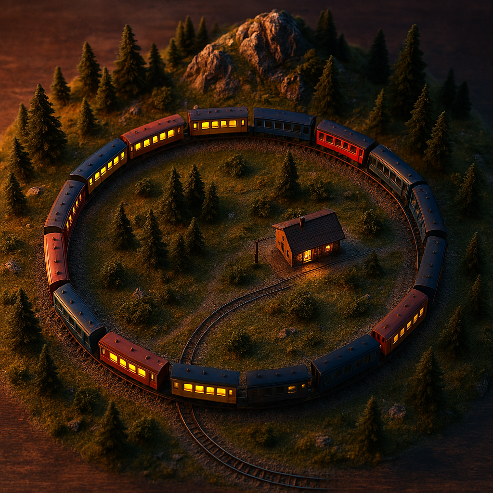
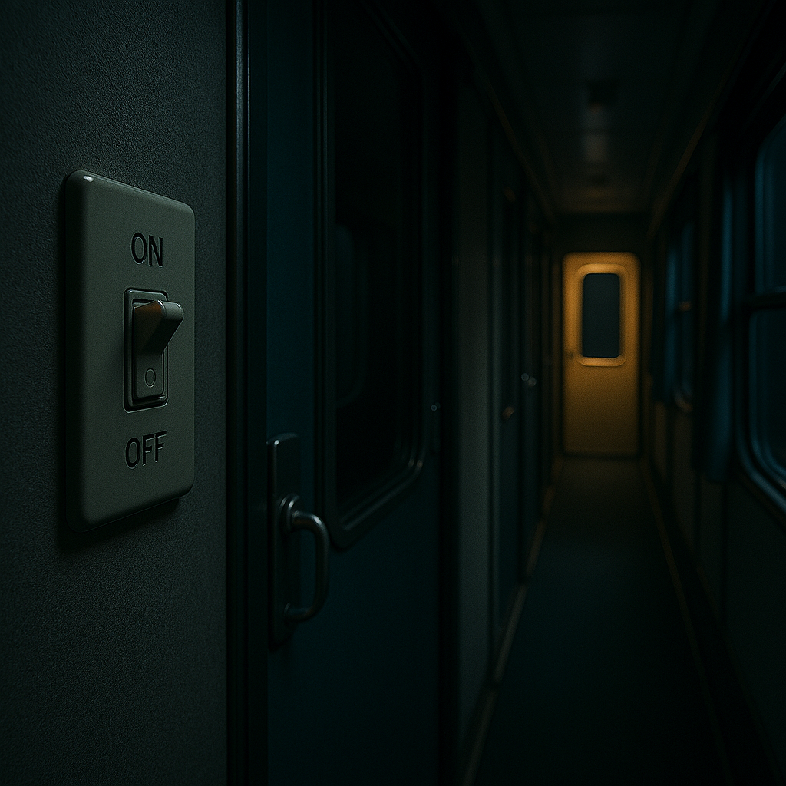
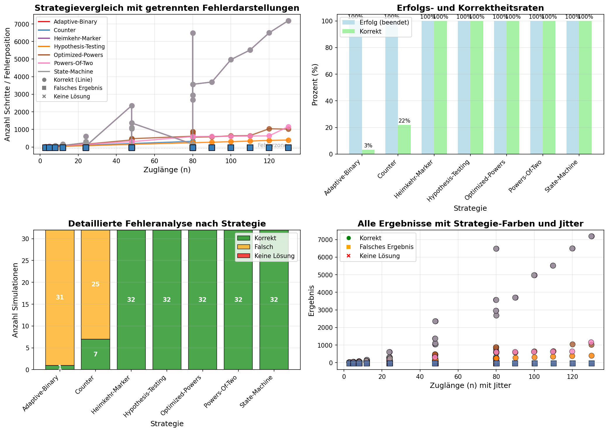
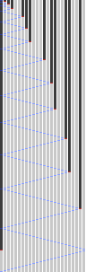

# Train Carriage Problem Simulator

A Python simulator for the classic "Train Carriage Problem" (also known as "Labyrinth Problem" or "Train-Carriage Problem") with multiple solution strategies and visualizations.




## 📖 The Puzzle

### Problem Statement
You are in a **closed train** with **n carriages** arranged in a circle. Each carriage has a **light switch** that can be either ON (1) or OFF (0). The initial configuration is **unknown** and random.

You as an agent can:
1. Move to the next/previous carriage (forward/backward)
2. Toggle the light switch in the current carriage
3. Remember limited information (memory)

**Goal**: Determine how many carriages the train has (n) and terminate.



### Example
- Starting position: Carriage 0
- Train has 5 carriages (n=5)
- Initial configuration: [1, 0, 1, 1, 0] (random)
- Goal: Determine that n=5

## 🎯 Inspiration Sources

I discovered this puzzle through these Instagram pages from Marc Ordower:
- https://www.instagram.com/reel/DPKchvZCSBY/?igsh=OWZuaXRldHY5anNv
- https://www.instagram.com/reel/DPXV7R2Cf8u/?igsh=eXBqMzVyOHFld3lo
- https://www.instagram.com/reel/DPfCHmuCfGK/?igsh=ajFreXl6ZDBib2tw

## 🚀 Installation

```bash
# Clone repository
git clone https://github.com/your-username/train-carriage-simulator.git
cd train-carriage-simulator

# Install dependencies
pip install -r requirements.txt
```

### Dependencies
- Python 3.7+
- Pillow (PIL) for visualizations
- pandas for data analysis
- matplotlib for plots
- numpy for numerical operations

```bash
pip install pillow pandas matplotlib numpy
```

## 🧠 Implemented Strategies

The simulator contains multiple solution strategies:

### 1. **Home-Marker** (Original Strategy)
- Turns off starting carriage
- Moves forward until finding OFF light
- Turns it ON and returns
- Repeats until start light is ON

### 2. **Powers-of-Two** (Logarithmic Strategy)
- Uses powers of two (1, 2, 4, 8, ...)
- Turns off lights in blocks
- Efficient for large n

### 3. **Hypothesis-Testing** (Hypothesis Testing)
- Searches for OFF lights for hypothesis formation
- Tests hypotheses with modular arithmetic
- Elegant mathematical solution
- Up to now best solution in most cases

### 4. **Optimized-Powers** (Optimized Powers-of-Two)
- Improved version of Powers-of-Two
- "Ignores" already OFF carriages
- Early termination possible

### 5. **State-Machine** (State Machine)
- Finite state machine implementation
- Clear state transitions

### 6. **Counter Strategy** (Counting Strategy)
- Counts OFF lights
- Adaptive thresholds
- mostly unsuccesful (needs tuning)
- example for unseccesful strategy

## 📊 Strategy Comparison

The simulator automatically creates:
- Success rates per strategy
- Step count comparisons
- Efficiency analyses (steps per carriage)
- Visualizations of all runs
- CSV export of results

## 🛠 Implementing Your Own Strategy

### Step 1: Create New Strategy File
Create a new file in the `strategies/` directory, e.g., `strategies/my_strategy.py`:

```python
def my_strategy(lamp_state, memory):
    """
    Implement your strategy logic here.
    
    Args:
        lamp_state: 0 (OFF) or 1 (ON) - current light state
        memory: Dictionary for persistent storage between calls
    
    Returns:
        tuple: (toggle, move, memory, done, estimated_n)
        - toggle: True/False - whether to toggle the light
        - move: -1 (backward), 0 (stay), +1 (forward)
        - memory: updated memory dictionary
        - done: True/False - whether strategy is finished
        - estimated_n: estimated number of carriages (if done=True)
    """
    # Initialize memory on first call
    if memory == {}:
        memory["phase"] = "start"
        memory["counter"] = 0
    
    toggle = False
    done = False
    estimated_n = None
    
    # Implement strategy logic here
    if memory["phase"] == "start":
        # Example: Turn off starting light
        if lamp_state == 1:
            toggle = True
        memory["phase"] = "search"
        return toggle, 1, memory, done, estimated_n
    
    elif memory["phase"] == "search":
        memory["counter"] += 1
        
        if lamp_state == 0:
            # Found what we're looking for
            toggle = True
            done = True
            estimated_n = memory["counter"]
            return toggle, 0, memory, done, estimated_n
        else:
            # Continue searching
            return toggle, +1, memory, done, estimated_n
    
    # Fallback
    return toggle, +1, memory, done, estimated_n

# Optional: Alternative names for auto-registration
my_strategy_alternative = my_strategy
```

### Step 2: Register Strategy (Optional)
By using automatic registration, the strategy will be auto-detected.:


### Step 3: Test Strategy
```python
from strategies import strategies


```

## 📈 Example Execution

```python
from main import compare_strategies

# Test configurations
test_configs = [
    (5, 0),   # 5 carriages, all OFF
    (5, 1),   # 5 carriages, all ON
    (5, 2),   # 5 carriages, random (2nd parameter is seed for random number generator)
    (10, 0),  # 10 carriages, all OFF
    # ... more configurations
]

# Run comparison
results = compare_strategies(
    configs=test_configs,
    strategies=strategies,  # All registered strategies
    max_steps=5000,
    save_images=True,
    output_dir="results"
)
```

---

## 🤖 LLM Prompt for Strategy Implementation

### Problem Description for LLMs
Here's a detailed prompt you can use with LLMs (like DeepSeek, ChatGPT, etc.) to generate new strategy implementations:
---

````
I need to implement a strategy for the "Train Carriage Problem" in Python. 

PROBLEM DESCRIPTION:
- There are n carriages arranged in a circle (positions 0 to n-1)
- Each carriage has a light: ON (1) or OFF (0)
- Initial configuration is random/unknown
- Agent starts at position 0
- Agent can: 
  1. Move forward (+1) or backward (-1) (wraps around modulo n)
  2. Toggle the current light (0→1 or 1→0)
  3. Use persistent memory between steps

GOAL: Determine n and terminate.

STRATEGY FUNCTION SPECIFICATION:
The strategy function must have this exact signature:
```python
def strategy_name(lamp_state: int, memory: dict) -> tuple:
    """
    Args:
        lamp_state: 0 (OFF) or 1 (ON) - current light state
        memory: Dictionary for persistent storage between calls
    
    Returns:
        tuple: (toggle, move, memory, done, estimated_n)
        - toggle: bool - whether to toggle the light
        - move: int - -1 (backward), 0 (stay), +1 (forward)
        - memory: dict - updated memory dictionary
        - done: bool - whether strategy is finished
        - estimated_n: int or None - estimated n if done=True
    """
```

IMPLEMENTATION REQUIREMENTS:
1. Initialize memory on first call: if memory == {}: ...
2. Always return move ≠ 0 except when done=True
3. When done=True, return estimated_n (the determined n)
4. Memory persists across calls - store state information

EXAMPLE TEMPLATE:
```python
def my_strategy(lamp_state, memory):
    if memory == {}:
        memory["phase"] = "start"
        memory["counter"] = 0
    
    toggle = False
    done = False
    estimated_n = None
    
    # Your strategy logic here
    if memory["phase"] == "start":
        # Initial actions
        if lamp_state == 1:
            toggle = True
        memory["phase"] = "search"
        return toggle, 1, memory, done, estimated_n
    
    # Continue with state machine...
    
    return toggle, +1, memory, done, estimated_n
```

STRATEGY IDEA TO IMPLEMENT:
[Describe your strategy idea here in words. For example:
"Start by turning light in carriage 0 OFF. Then move forward until finding 
a light that is ON, turn it OFF, and return to start. Count steps. Repeat 
until start light changes, indicating full cycle."]

Please implement this strategy in Python with proper state management.
````

### Example Strategy Description for LLMs
```
STRATEGY: "Binary Search Approach"
1. Start with carriage 0 light ON
2. Use binary search principle: maintain low=0, high=unknown
3. Move forward in exponentially increasing steps
4. When finding OFF light, mark as potential boundary
5. Return to start and adjust search range
6. When range converges to single value, verify by checking light change
7. Terminate with estimated n
```

---

## 📊 Visualization Examples

### 1. Strategy Comparison Visualization



## 🖼️ Simulation Visualization Examples

 - Dark gray (OFF, no agent)  
 - Light gray (ON, no agent)  
 - Dark blue (OFF with agent)  
 - Light blue (ON with agent)  
 - **Dark red (Toggle OFF→ON)**  
 - Light red (Toggle ON→OFF)


### File Naming Convention
Generated images follow this pattern: **`n{WAGGONS}_k{CONFIG}_{STRATEGY}.png`**

| Example File | Interpretation |
|--------------|----------------|
| `n12_k2_Heimkehr-Marker.png` | 12 waggons, random config (seed=2), Home-Marker strategy |
| `n24_k0_Powers-of-Two.png` | 24 waggons, all OFF, Powers-of-Two strategy |
| `n48_k3_Hypothesis-OFF.png` | 48 waggons, random seed 3, Hypothesis Testing |

**Configuration Key:**
- `k0`: All lights OFF
- `k1`: All lights ON  
- `k2+`: Random configuration (deterministic seed: `n×1000 + k`)

### Example Visualization


**File:** `n24_k3_Heimkehr-Marker.png`  
**Interpretation:** 24 waggons with random initial configuration (seed 3) using Home-Marker strategy.


**Train Configuration:**
- **Waggons:** 24
- **Initial state (k=3):** `000011000111010011001101`
- **Total steps required:** 303
- **Strategy:** Heimkehr-Marker (Home-Marker)

**Initial Light Pattern:**
```
Positions: 00 01 02 03 04 05 06 07 08 09 10 11 12 13 14 15 16 17 18 19 20 21 22 23
Lights:    0  0  0  0  1  1  0  0  0  1  1  1  0  1  0  0  1  1  0  0  1  1  0  1
           │  │  │  │  │  │  │  │  │  │  │  │  │  │  │  │  │  │  │  │  │  │  │  │
Legend:   OFF OFF OFF OFF ON  ON  OFF OFF OFF ON  ON  ON  OFF ON  OFF OFF ON  ON  OFF OFF ON  ON  OFF ON
```

**Algorithm Logic:**
1. **Start:** Turn OFF light in carriage 0 (if it's ON)
2. **Forward search:** Move forward until finding an OFF light
3. **Action:** Turn that OFF light ON (marker creation)
4. **Return:** Go back to start (carriage 0)
5. **Check:** If start light is ON → Done! (n = steps in last cycle)
6. **Repeat:** Otherwise, start new cycle


**Phase Analysis (303 Steps Total):**

1. **Initialization Phase (Steps 0-40):**
   - Agent starts at position 0
   - Since initial light at position 0 is already OFF (0), no toggle needed
   - Immediate forward search begins
   - First OFF light found quickly (positions 1-3 are all OFF)
   - First **dark red pixel** appears early (first marker creation)

2. **Early Cycles (Steps 41-120):**
   - Pattern of "search forward → find OFF → turn ON → return" emerges
   - Each cycle creates a **V-shaped pattern** in visualization:
     - Right diagonal: Forward search (blue pixels)
     - Dark red pixel: Toggle action (OFF→ON)
     - Left diagonal: Return to start (blue pixels)
   - Cycle length increases gradually
   - More dark red pixels appear as algorithm progresses

3. **Mid-Game Development (Steps 121-220):**
   - Agent must travel further to find remaining OFF lights
   - Diagonal streaks become longer
   - The "checkerboard" pattern of lights evolves:
     - Initially: Many OFF lights (dark horizontal bands)
     - Progressively: More ON lights (light horizontal bands)
   - Agent spends more time in forward search phase

4. **Endgame Phase (Steps 221-290):**
   - Very few OFF lights remain
   - Agent makes long journeys to find last markers
   - Return paths become especially long (steep left diagonals)
   - Pattern shows increasing cycle lengths
   - Last dark red pixels mark final marker creations

5. **Verification & Termination (Steps 291-303):**
   - Agent returns to start after last toggle
   - Finds start light is ON (because all lights are now ON)
   - Algorithm terminates successfully
   - Final step shows verification

**Pattern-Specific Observations for n=24, k=3:**
1. **Initial 4 consecutive OFF lights (0000):** Creates cluster of early toggles
2. **ON lights at positions 4-5 (11):** First "gap" requiring longer search
3. **Pattern 000111010...:** Creates irregular but deterministic exploration
4. **Total of 24 toggles:** One for each carriage (turning all lights ON)
5. **Symmetry:** The visualization shows beautiful symmetry of algorithm

**Algorithm Performance Insights:**
- **Total cycles:** Approximately n/2 = 12 complete cycles on average
- **Efficiency characteristic:** O(n²) - visible as expanding triangular patterns
- **Worst-case scenario:** When all lights start OFF - requires maximum cycles
- **Best-case scenario:** When all lights start ON - terminates immediately
- **This case (mixed):** Moderate performance

**Why This Specific Pattern Emerges:**
The initial configuration `000011000111010011001101` creates a unique fingerprint:
- Early clusters of OFF lights → quick initial progress
- Isolated OFF lights later → longer search periods
- The algorithm systematically "fills in" the OFF positions
- Each complete pass increases search distance

**Visual Debugging Insights:**
1. **Missing dark red pixels:** Would indicate algorithm error (not turning OFF lights ON)
2. **Irregular patterns:** Could indicate logic errors in state management
3. **Premature termination:** Would show as early stop in pattern
4. **Correct execution:** Shows gradual progression with increasing cycle lengths

**Mathematical Verification:**
- **Expected behavior:** After n cycles, all lights should be ON
- **Verification:** When agent returns to start and light is ON → success
- **Step count formula:** Roughly n*(n+1)/2 for worst case
- **This simulation:** 303 steps ≈ 24×12.6 (better than worst case due to initial ON lights)

*The visualization serves as both proof of correctness and performance analysis tool, clearly showing the algorithm's systematic approach to solving the puzzle.*

## 📁 Project Structure

```
train-carriage-simulator/
├── main.py                    # Main program
├── requirements.txt          # Dependencies
├── README.md                # This file
├── strategies/              # Strategies directory
│   ├── __init__.py         # Strategy registration
│   ├── base_strategy.py    # Base classes/helpers
│   ├── home_marker.py      # Home-Marker strategy
│   ├── powers_of_two.py    # Powers-of-Two strategy
│   ├── hypothesis_off.py   # Hypothesis-Testing strategy
│   ├── optimized_powers.py # Optimized Powers-of-Two
│   ├── state_machine.py    # State-Machine strategy
│   ├── counter.py          # Counter strategy
│   └── adaptive_binary.py  # Adaptive Binary strategy
├── utils/                  # Utility functions
│   ├── simulator.py       # Simulation engine
│   ├── visualizer.py      # Visualization functions
│   └── analyzer.py        # Data analysis
└── simulation_results/    # Output directory (auto-created)
```

## 📊 Output

The program automatically creates:
1. **CSV files** with detailed results
2. **PNG images** of simulations
3. **Comparison plots** of strategies
4. **Statistics summaries**

Example output:
```
Success rate of 'Home-Marker': 100%
Average steps for n=10: 45.2
Efficiency: 4.52 steps/carriage
```

## 🧮 Mathematical Foundations

### Complexity Analysis
- **Home-Marker**: O(n²) steps
- **Powers-of-Two**: O(n log n) steps
- **Hypothesis-Testing**: O(n) steps (best case)

### Correctness Proofs
Each strategy is based on mathematical principles:
- **Modular arithmetic** for ring structure
- **Invariants** for termination
- **Induction** for correctness

## 🤝 Contributing

Contributions are welcome! Possible improvements:
- Implement new strategies
- Performance optimizations
- Better visualizations
- Additional analysis tools
- Web interface

If new strategies are pulled, I will update the report with the overall ranking. I may change the seed of the random generator or the length of the trains.

### Contribution Guidelines
1. Fork the repository
2. Create a feature branch
3. Commit your changes
4. Push to the branch
5. Create a pull request

## 📝 License

This project is licensed under the MIT License. See [LICENSE](LICENSE) file for details.

## 🙏 Acknowledgments

This project was developed with the assistance of [DeepSeek](https://www.deepseek.com/), which helped with:
- Strategy implementation
- Visualization creation
- Code optimization
- Documentation

Special thanks to Marc Ordower. He created the Instagram pages that spread this fascinating puzzle and inspired this project.

https://www.instagram.com/reel/DPKchvZCSBY/?igsh=OWZuaXRldHY5anNv
https://www.instagram.com/reel/DPXV7R2Cf8u/?igsh=eXBqMzVyOHFld3lo
https://www.instagram.com/reel/DPfCHmuCfGK/?igsh=ajFreXl6ZDBib2tw

## 🔗 Links

- [GitHub Repository](https://github.com/Maik7/train-carriage-simulator)
- [Issue Tracker](https://github.com/Maik 7/train-carriage-simulator/issues)


## 💡 Tips for Creating Your Own Strategies

1. **Minimize memory usage**: Keep only essential information
2. **Think in cycles**: Recognize complete loops
3. **Test edge cases**: n=1, all lights ON/OFF
4. **Visualize**: Use built-in visualization tools

---

*Have a better strategy? Share it with the community!* 🚂✨
